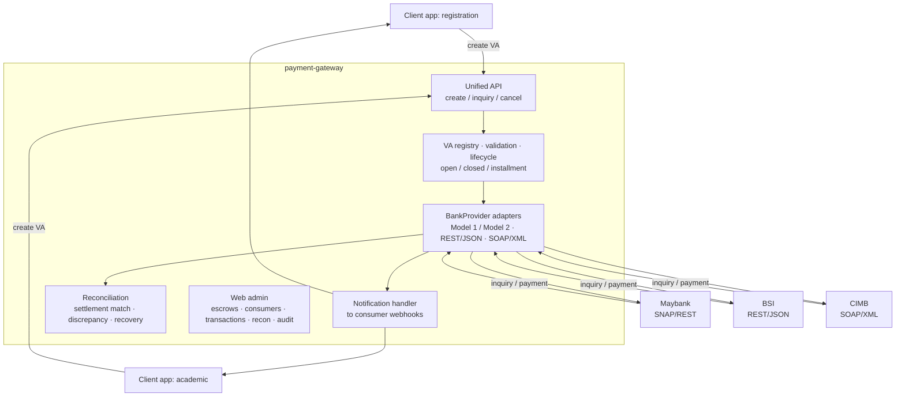

# payment-gateway

Self-hosted, multi-bank Virtual Account (VA) payment gateway for Indonesian institutions. Client applications integrate once against a unified API; per-bank adapters behind it speak each bank's own protocol — SNAP, proprietary REST/JSON, or SOAP/XML. It runs on the operator's own infrastructure: the operator holds the bank relationships and the settlement accounts, and the gateway never holds funds.

## Problem

Institutions that collect via VA (campuses, hospitals, foundations) otherwise choose between:

- **SaaS aggregators** — a per-transaction fee on every collection. On enrollment-scale amounts (tuition, building fees) that fee is large in absolute terms.
- **Direct per-bank integration** — a separate, differently-shaped integration for each bank, and no unified reconciliation across them.

This gateway provides one API across many banks, self-hosted, with no per-transaction middleman fee — only the bank's own cost — and a single reconciliation view.

## Scope

- **Channel:** Virtual Account, inbound collection.
- **Banks at launch:** Maybank (SNAP / REST), BSI (proprietary REST/JSON), CIMB (proprietary SOAP/XML).
- **Out of scope:** QRIS (percentage MDR is prohibitive for enrollment-scale amounts; flat VA pricing fits that case), outbound disbursement (separate product), credit cards, e-wallets.

## VA hosting models

Selected per escrow account; both supported:

- **Gateway-hosted (Model 1)** — the gateway holds the VA registry. The bank calls the gateway to resolve a VA number (returns payer name + bill, or not-found) and to notify payment. No VA registration at the bank.
- **Bank-hosted (Model 2)** — the bank holds the VA registry. The gateway registers each VA at the bank on creation; the bank validates payments against its own records and notifies the gateway only on payment.

## Virtual Account types

Set per VA:

- **Open** — persistent, free amount, accepts repeated payments.
- **Closed** — fixed amount, single payment, closes on settlement.
- **Installment** — repeated payments accumulating up to a target amount.

## VA number allocation

Client applications compute the VA number (per their own policy — e.g. derived from a registrant or student identifier). The gateway validates the number against the escrow account's number space (company id + prefix + available digits) and its availability, then registers it. The gateway does not generate numbers.

## Reconciliation

End-of-day cross-check of recorded payments against the bank's actual settlement, per escrow account: matches each credit to a payment, recovers dropped notifications (paid but not notified), and flags amount mismatches, duplicates, and unmatched credits. Reporting per escrow account and per institution grouping.

## Architecture

## Stack

Spring Boot 4 · Java 25 · PostgreSQL 18 + Flyway · Spring WebClient · Thymeleaf + HTMX + Tailwind (admin) · Testcontainers + WireMock + [snap-provider-simulator](https://github.com/artivisi/snap-provider-simulator) (tests).

## Status

Greenfield, under construction.

## License

Apache 2.0.
