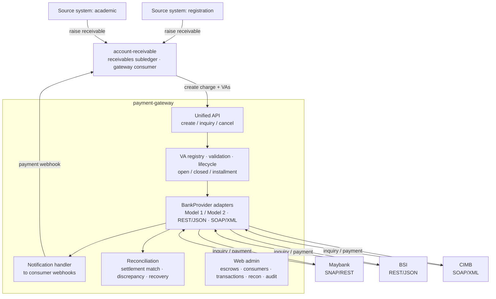

# payment-gateway

Self-hosted, multi-bank Virtual Account (VA) payment gateway for Indonesian institutions. Client applications integrate once against a unified API; per-bank adapters behind it speak each bank's own protocol — SNAP, proprietary REST/JSON, or SOAP/XML. It runs on the operator's own infrastructure: the operator holds the bank relationships and the settlement accounts, and the gateway never holds funds.

## Problem

Institutions that collect via VA (campuses, hospitals, foundations) otherwise choose between:

- **SaaS aggregators** — a per-transaction fee on every collection. On enrollment-scale amounts (tuition, building fees) that fee is large in absolute terms.
- **Direct per-bank integration** — a separate, differently-shaped integration for each bank, and no unified reconciliation across them.

This gateway provides one API across many banks, self-hosted, with no per-transaction middleman fee — only the bank's own cost — and a single reconciliation view.

## Scope

- **Channel:** Virtual Account, inbound collection.
- **Banks at launch:** Maybank (SNAP / REST), BSI (proprietary REST/JSON), CIMB (proprietary SOAP/XML).
- **Out of scope:** QRIS (percentage MDR is prohibitive for enrollment-scale amounts; flat VA pricing fits that case), outbound disbursement (separate product), credit cards, e-wallets.

## VA hosting models

Selected per escrow account; both supported:

- **Gateway-hosted (Model 1)** — the gateway holds the VA registry. The bank calls the gateway to resolve a VA number (returns payer name + bill, or not-found) and to notify payment. No VA registration at the bank.
- **Bank-hosted (Model 2)** — the bank holds the VA registry. The gateway registers each VA at the bank on creation; the bank validates payments against its own records and notifies the gateway only on payment.

## Charge types

A **charge** is one bill — a single amount owed by one payer. The type is set per charge:

- **Open** — persistent, free amount, accepts repeated payments.
- **Closed** — fixed amount, single payment, closes on settlement.
- **Installment** — repeated payments accumulating up to a target amount.

## Pay via any bank

One charge is payable through **1..N sibling virtual accounts**, one per target bank (escrow). The payer can settle at whichever bank is convenient, and the gateway owns the single-debt invariant so consumers never reimplement double-payment prevention:

- **Closed** — the first full payment marks the charge paid and cancels every sibling VA.
- **Open / Installment** — payments share one cumulative balance across siblings (a partial payment at one bank lowers the remaining due at every other); siblings reprice on their next inquiry; the charge completes when the cumulative reaches the target, then the siblings cancel.
- A near-simultaneous double settlement at two banks is flagged as an overpayment discrepancy for out-of-band refund — never silently accepted.

## VA number allocation

Client applications compute the VA number (per their own policy — e.g. derived from a registrant or student identifier). The gateway validates the number against the escrow account's number space (company id + prefix + available digits) and its availability, then registers it. The gateway does not generate numbers.

## Reconciliation

End-of-day cross-check of recorded payments against the bank's actual settlement, per escrow account: matches each credit to a payment, recovers dropped notifications (paid but not notified), and flags amount mismatches, duplicates, and unmatched credits. Reporting per escrow account and per institution grouping.

Indonesian banks generally do not expose a settlement-pull API — settlement is a **CSV exported from the bank's cash-management portal** (or a statement), uploaded to the reconciliation importer. Per-bank CSV column/format mapping is the open work here.

## Admin & access control

A Thymeleaf admin UI manages escrows, consumers, charges/payments, reconciliation, webhooks, operators, and the audit log.

- **Operator accounts** with **permission-based roles** — a fixed permission vocabulary (feature → permission) bundled into **data-driven roles** (ADMIN / OPERATOR / AUDITOR built-in, plus custom roles created at runtime). One role per operator.
- **TOTP MFA** required for all operators; forced password change + MFA enrolment on first login. bcrypt passwords, account lockout, idle-session timeout. No default credential — the first admin is seeded from required config.
- **Bank-callback IP allowlist** — per-provider source-IP rules (managed in the UI) gate the bank endpoints, replacing network-layer filtering for banks without message-level auth (BSI checksum-only, CIMB none; Maybank uses SNAP signatures).
- Every audited action records the authenticated operator. This is a PCI-DSS-aligned control baseline; the app is out of PCI scope (no card data). See [`docs/security/pci-dss.md`](docs/security/pci-dss.md).

## Running

Prerequisites: JDK 25, Docker (for the test suite's Testcontainers), PostgreSQL 18 (or use the bundled `compose.yml` for local Postgres).

Required configuration (no defaults — the app fails to start if any is missing):

| Variable | Purpose |
|---|---|
| `GATEWAY_DB_URL` / `GATEWAY_DB_USERNAME` / `GATEWAY_DB_PASSWORD` | PostgreSQL connection |
| `GATEWAY_SECRET_KEY` | Base64-encoded 32-byte AES-256 key; encrypts stored secrets |
| `GATEWAY_ADMIN_USERNAME` / `GATEWAY_ADMIN_PASSWORD` | Bootstrap admin, seeded when no operator exists |

```bash
# Build + run the full test suite (Testcontainers spins up PostgreSQL 18; needs Docker)
mvn verify

# Run locally (Flyway applies migrations on startup)
GATEWAY_DB_URL=jdbc:postgresql://localhost:5432/gateway \
GATEWAY_DB_USERNAME=gateway GATEWAY_DB_PASSWORD=gateway \
GATEWAY_SECRET_KEY=$(head -c32 /dev/urandom | base64) \
GATEWAY_ADMIN_USERNAME=admin GATEWAY_ADMIN_PASSWORD='change-me-on-first-login' \
mvn spring-boot:run
```

The admin UI is at `/admin`. On first login the bootstrap admin must change its password and enrol MFA.

## Architecture

The gateway's consumer is typically not an end application but a receivables system — e.g. the sibling [account-receivable](../account-receivable) subledger — which fronts the source systems, opens a charge per receivable, and applies the collected cash. Any application can also consume the API directly.



## Stack

Spring Boot 4 · Java 25 · PostgreSQL 18 + Flyway · Spring WebClient · Spring Security (operator auth, TOTP MFA) · Thymeleaf + HTMX + Tailwind (admin) · Testcontainers + RestAssured + Playwright + [snap-provider-simulator](https://github.com/artivisi/snap-provider-simulator) (tests).

## Status

Active development. Implemented: charge + sibling-VA lifecycle and Consumer API; webhook delivery (signed, retried, per-consumer isolation); the three launch adapters (Maybank SNAP, BSI REST, CIMB SOAP); reconciliation with CSV import; the admin UI with operator auth, RBAC and MFA. Open: per-bank reconciliation CSV mappings, expiry sweep, outbound settlement pull (only if a bank offers it), bank-hosted (Model 2) adapters. See [`IMPLEMENTATION-PLAN.md`](IMPLEMENTATION-PLAN.md).

## License

Apache 2.0.
