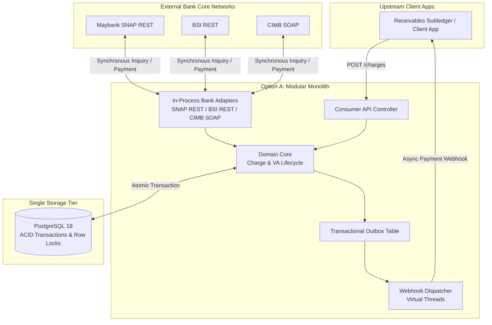
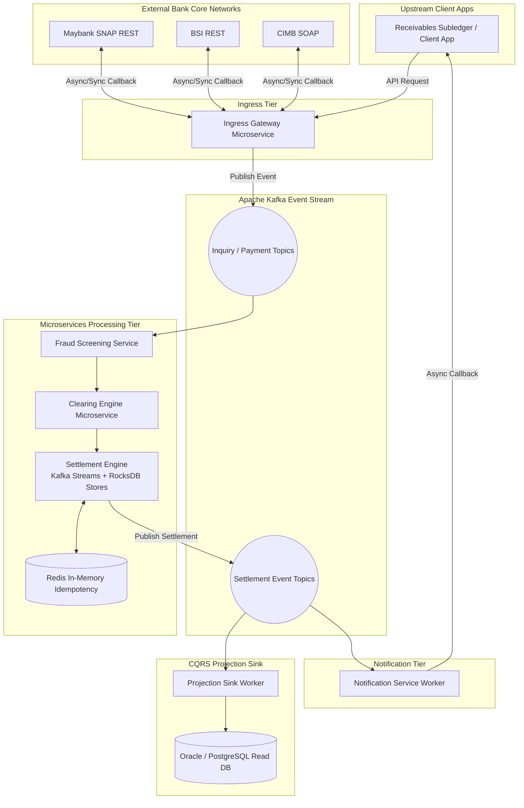
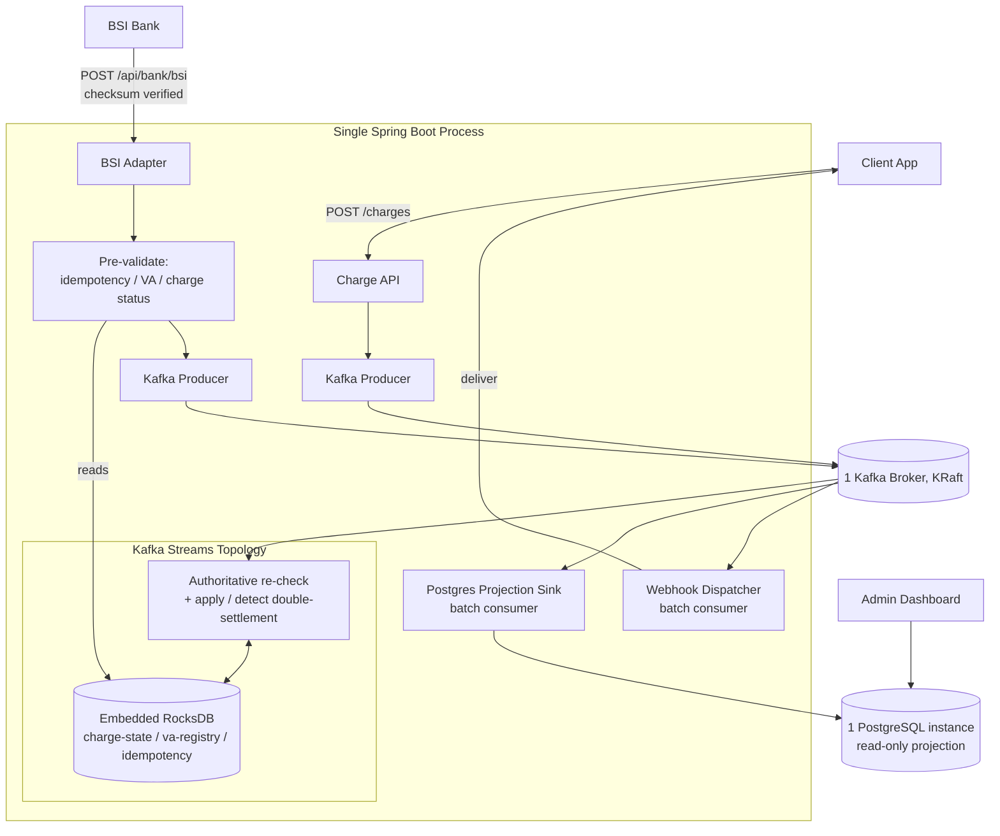

# Initial Architecture Trade-off Analysis & Design Selection

## Executive Summary & Architectural Selection

> [!IMPORTANT]
> **Design Selection:** **Option A (Modular Monolith with PostgreSQL RDBMS)** is selected over **Option B (Event-Driven Microservices with Apache Kafka)** as the initial architecture for `payment-gateway`.
>
> Prior to implementation, an architectural trade-off analysis was conducted to compare a monolithic RDBMS-centric design against a high-throughput event-streaming microservices architecture. Option A was selected because its synchronous, ACID-compliant, low-operational-footprint model natively aligns with Virtual Account collection requirements, whereas Option B introduces unnecessary distributed state management complexity and network latency for this application's domain.

---

## Architectural Candidates

To establish the foundational design for the gateway, two candidate architectural paradigms were evaluated:

### Option A: Modular Monolith (Selected Design)
* **Domain Focus:** Multi-bank Virtual Account (VA) collection and lifecycle gateway.
* **Core Paradigm:** In-process bank adapters, synchronous request-response ingress, relational ACID transactions.
* **Tech Stack:** Java 25, Spring Boot 4, PostgreSQL 18, Flyway, Spring WebClient, Virtual Threads.
* **State & Consistency:** PostgreSQL 18 as single source of truth; pessimistic/optimistic row-level locking (`SELECT FOR UPDATE`) for shared cross-account debt state.

---

### Option B: Event-Driven Microservices (Reference Architecture)
* **Domain Focus:** High-throughput event clearing and real-time transaction processing.
* **Core Paradigm:** Event sourcing, CQRS (Command Query Responsibility Segregation), partitioned stream processing.
* **Tech Stack:** Java / Spring Boot microservices, Apache Kafka, Kafka Streams (RocksDB state stores), Redis, RDBMS projection sinks.
* **State & Consistency:** Kafka event log as source of truth; RocksDB in-memory state stores partitioned by key; Eventually consistent CQRS projections with Exactly-Once Semantics (EOS).

> [!NOTE]
> This is the generic reference architecture evaluated *before* either option was built — not a
> depiction of any implementation. The comparison implementation later built for benchmarking
> (`payment-gateway-evtsrc`) has none of the Fraud/Clearing/Settlement microservice split or Redis
> shown above; see "What was actually built" in the Post-Selection Validation section for its real
> architecture diagram.

---

## Architectural Trade-off Matrix

| Architectural Dimension | Option A (Modular Monolith) | Option B (Event-Driven Reference) |
| :--- | :--- | :--- |
| **System Topology** | **Modular Monolith** (Single deployable application binary). | **Distributed Microservices** (Multiple decoupled services). |
| **Ingress Pattern** | **Synchronous Request-Response** (HTTP REST / SOAP XML). | **Asynchronous / Streaming Pipeline** (Event topics + Message ingress). |
| **State & Source of Truth** | **Relational Database** (PostgreSQL 18 with Flyway migrations). | **Event Log** (Apache Kafka) + RocksDB local state stores. |
| **Query & Read Model** | **Direct RDBMS Queries** (Indexed SQL reads & joins). | **CQRS Projection Sink** (Kafka streams to RDBMS read model). |
| **Concurrency Control** | **Pessimistic / Optimistic DB Locks** per aggregate root. | **Partition Key Sharding** (Lock-free execution per stream partition). |
| **Cross-Entity Invariants** | **Atomic Multi-Row Transactions** (ACID boundaries). | **Distributed Stream Processing** (Eventual consistency / Sagas). |
| **Throughput Capacity** | Hundreds to thousands of ACID TPS per single node. | Tens of thousands of continuous TPS across partitioned cluster. |
| **Operational Overhead** | **Minimal:** 1 app instance + 1 PostgreSQL database. | **High:** Microservice fleet, Kafka brokers, Zookeeper/KRaft, Redis, RDBMS. |

---

## Trade-off Analysis & Evaluation Criteria

### 1. Ingress Protocol Alignment (Synchronous vs. Asynchronous)

* **Domain Requirement:** Upstream integration with bank core networks and ATM interfaces relies on **synchronous HTTP/SOAP request-response** protocols. When an external bank system queries a Virtual Account (`onInquiry`), the gateway must reply within a strict 2–3 second timeout with verified bill details.
* **Evaluation:** In Option B, inserting a Kafka event bus between the bank's HTTP callback and the internal processing core adds message broker serialization overhead and asynchronous polling hops, while the HTTP thread must still block waiting for a response. Option A processes inquiries in-process with minimal latency, making it architecturally superior for synchronous protocols.

### 2. Multi-Bank Debt Invariants ("Pay via Any Bank")

* **Domain Requirement:** A single debt aggregate (`Charge`) can be backed by 1..N sibling Virtual Accounts across different bank escrows. A payment received at one bank must immediately adjust shared cumulative balances or cancel sibling VAs to prevent double-payment or duplicate settlement.
* **Evaluation:** Option A guarantees this single-debt invariant cleanly using **relational row locking** (`SELECT FOR UPDATE`) within a single PostgreSQL transaction. Enforcing the same multi-bank invariant in Option B requires complex distributed sagas or single-partition event bottlenecks, introducing race condition risks when two banks process payments simultaneously.

### 3. Throughput Requirements vs. RDBMS Capacity

* **Domain Requirement:** Typical collection gateway workloads operate at peak rates of tens to a few hundred transactions per second (TPS) during billing windows.
* **Evaluation:** A modern, tuned PostgreSQL 18 instance supports **5,000–10,000+ ACID transactions per second** on standard server hardware. Option B is engineered for multi-thousand continuous TPS workloads distributed across multiple worker nodes. Choosing Option B for Option A's scale profile represents premature optimization and unneeded architectural complexity.

### 4. Operational Footprint & Deployment Strategy

* **Domain Requirement:** The gateway is designed for self-hosted deployment by single operators or institutions holding direct bank relationships.
* **Evaluation:** Option A requires minimal operational management (a single Spring Boot binary and a PostgreSQL database). Option B as scoped here (a full microservices decomposition with a separate fraud/clearing/settlement tier and Redis) requires running and maintaining a Kafka cluster, ZooKeeper/KRaft nodes, Redis caches, and separate projection worker services, creating high infrastructure costs and complex operational procedures. A lighter single-JVM variant was later built and benchmarked for comparison — see "Post-Selection Validation" below — and needed less infrastructure than this section describes (no Redis, no service fleet, KRaft only), but still required meaningfully more operational surface and implementation effort than Option A to reach correctness parity.

---

## Conclusion

**Option A (Modular Monolith with PostgreSQL RDBMS)** is selected as the initial architecture for `payment-gateway`. It meets all business requirements for synchronous bank callbacks, strict multi-bank debt consistency, and low operational overhead, while avoiding the distributed system complexity of an event-streaming microservices platform.

This selection was made before either option was built, based on the reasoning above. See "Post-Selection Validation" below for what was actually measured once a comparison implementation existed.

---

## Post-Selection Validation (2026-07-28)

A comparison implementation was later built: [`payment-gateway-evtsrc`](https://github.com/artivisi/payment-gateway-evtsrc), a single-JVM (not microservices) variant using Apache Kafka + embedded RocksDB as the write-side source of truth and PostgreSQL as an async CQRS read projection. It is lighter than the "Option B" reference architecture above — one Spring Boot binary, no Redis, no separate fraud/clearing/settlement services, KRaft instead of ZooKeeper — but still represents the same core trade-off this document evaluated (event log + local state store vs. a single relational transaction).

Full methodology, hardware details, and per-system numbers are in [`payment-gateway-evtsrc/scenarios/perf_benchmark_report.md`](https://github.com/artivisi/payment-gateway-evtsrc/blob/main/scenarios/perf_benchmark_report.md) (section 8). A short summary and this repo's own results are in [`docs/benchmark-report.md`](benchmark-report.md).

### What was actually built

No separate Fraud/Clearing/Settlement services, no Redis, no microservices fleet — one Spring Boot process with an embedded Kafka Streams engine, talking to one Kafka broker and one Postgres instance:

Everything left of the Kafka broker (API controllers, pre-validation, the streams topology, the projection sink, the webhook worker) runs in the same JVM as one deployable artifact — the only external processes are the Kafka broker and Postgres.

### What was confirmed

| Trade-off argument (above) | Measured outcome |
|---|---|
| Section 1 — synchronous protocols favor fewer hops | Confirmed: this system's median latency (674 microseconds) was about 6x lower than the event-sourced variant's (3.95 milliseconds) under the identical BSI protocol workload. |
| Section 2 — row locking is simpler/safer than distributed invariant enforcement | Confirmed, and by a sharper failure mode than anticipated: the event-sourced variant had to re-implement the OPEN-vs-INSTALLMENT charge closing rule in two separate stores (its Kafka Streams topology and its Postgres projection), and the two silently disagreed until the mismatch was found. This system's single `PaymentApplicationService` never had that failure mode available to it. |
| Section 3 — RDBMS throughput is sufficient, Kafka-scale is premature at this workload | Consistent: this system absorbed a ramp to a 2,000 TPS target using only 26 of 2,000 allotted virtual users, with 0% errors. Neither system was pushed to an actual throughput ceiling, so the specific "5,000-10,000+ TPS" figure in section 3 above was not independently verified. |
| Section 4 — lower operational footprint | Confirmed in effort, not just infrastructure: getting the event-sourced comparison implementation to correct behavior took substantially more fixes (a missing framework dependency that silently broke persistence, three iterations to get its own test harness right, the two-store invariant bug above) than this system needed at any point. |
