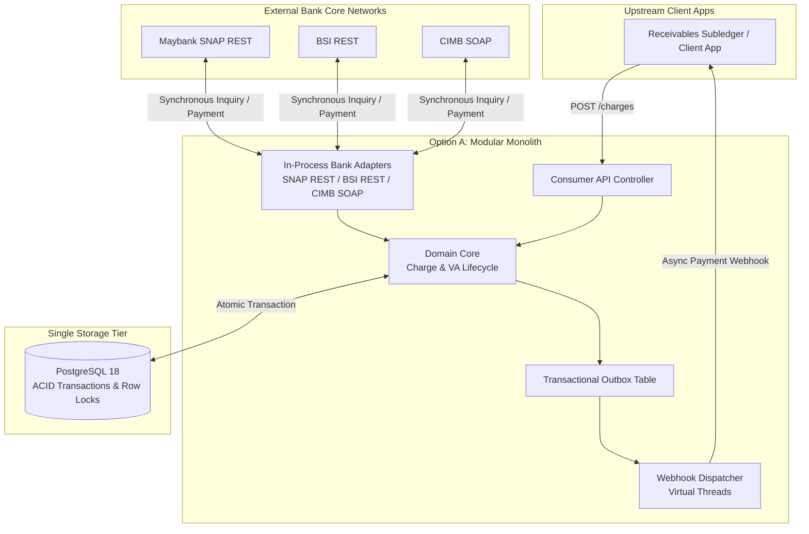
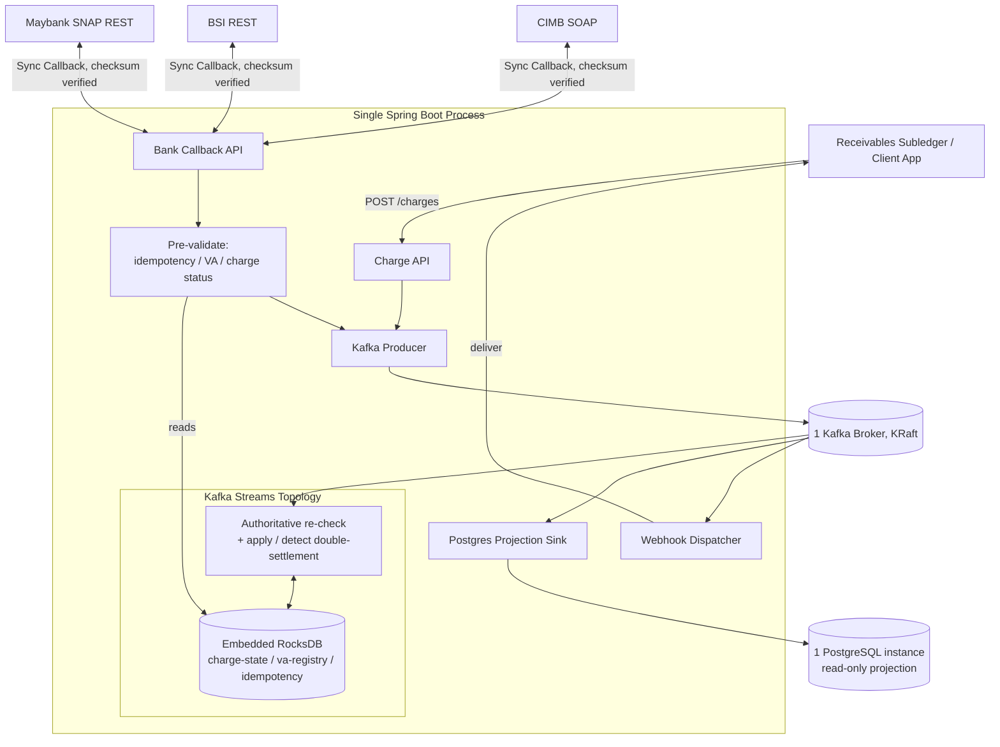

# Initial Architecture Trade-off Analysis & Design Selection

## Executive Summary & Architectural Selection

> [!IMPORTANT]
> **Design Selection:** **Option A (Modular Monolith with PostgreSQL RDBMS)** is selected over **Option B (Event-Sourced/CQRS with Apache Kafka)** as the initial architecture for `payment-gateway`. Both options are evaluated as single-JVM monoliths — the distinguishing choice is the state model (relational/synchronous vs. event log + local state store), not application topology.
>
> Prior to implementation, an architectural trade-off analysis was conducted to compare a relational, synchronous design against an event-sourced/CQRS design — both single-JVM monoliths. Option A was selected because its synchronous, ACID-compliant, low-operational-footprint model natively aligns with Virtual Account collection requirements, whereas Option B introduces state management complexity and network latency for this application's domain without a corresponding benefit at this scale.

---

## Architectural Candidates

To establish the foundational design for the gateway, two candidate architectural paradigms were evaluated:

### Option A: Modular Monolith (Selected Design)
* **Domain Focus:** Multi-bank Virtual Account (VA) collection and lifecycle gateway.
* **Core Paradigm:** In-process bank adapters, synchronous request-response ingress, relational ACID transactions.
* **Tech Stack:** Java 25, Spring Boot 4, PostgreSQL 18, Flyway, Spring WebClient, Virtual Threads.
* **State & Consistency:** PostgreSQL 18 as single source of truth; pessimistic/optimistic row-level locking (`SELECT FOR UPDATE`) for shared cross-account debt state.

---

### Option B: Event-Sourced / CQRS Monolith (Reference Architecture)
* **Domain Focus:** Multi-bank Virtual Account (VA) collection and lifecycle gateway (same domain as Option A).
* **Core Paradigm:** Event sourcing, CQRS (Command Query Responsibility Segregation) — a single-JVM monolith, same topology as Option A, with a different state model.
* **Tech Stack:** Java 25, Spring Boot 4, Apache Kafka (single broker, KRaft), embedded Kafka Streams (RocksDB state stores), PostgreSQL 18 as an async read projection.
* **State & Consistency:** Kafka event log + embedded RocksDB as the write-side source of truth; PostgreSQL as an eventually-consistent CQRS read projection.

Everything left of the Kafka broker (API controllers, pre-validation, the streams topology, the
projection sink, the webhook worker) runs in the same JVM as one deployable artifact. Infrastructure
is one Kafka broker and one PostgreSQL instance — no separate microservices, no Redis.

---

## Architectural Trade-off Matrix

| Architectural Dimension | Option A (Modular Monolith) | Option B (Event-Sourced/CQRS) |
| :--- | :--- | :--- |
| **System Topology** | **Modular Monolith** (Single deployable application binary). | **Modular Monolith** (Single deployable application binary) — same topology as Option A; only the state model differs. |
| **Ingress Pattern** | **Synchronous Request-Response** (HTTP REST / SOAP XML). | **Synchronous Request-Response**, with pre-validation against local RocksDB before an async Kafka append. |
| **State & Source of Truth** | **Relational Database** (PostgreSQL 18 with Flyway migrations). | **Event Log** (Apache Kafka) + embedded RocksDB local state stores. |
| **Query & Read Model** | **Direct RDBMS Queries** (Indexed SQL reads & joins). | **CQRS Projection Sink** (a Kafka consumer batches writes into a PostgreSQL read model). |
| **Concurrency Control** | **Pessimistic / Optimistic DB Locks** per aggregate root. | **Partition Key Sharding** (single writer per Kafka partition key, no locks). |
| **Cross-Entity Invariants** | **Atomic Multi-Row Transactions** (ACID boundaries). | **Detect-and-flag**: a race can still land as accepted at pre-validation; the single-writer partition-key stage re-checks and flags an overpayment rather than preventing it synchronously. |
| **Throughput Capacity** | Hundreds to thousands of ACID TPS per single node. | Comparable at the tested scale (both comfortably absorbed a 2,000 TPS benchmark with headroom); a multi-broker, multi-partition scale-out ceiling was not built or tested. |
| **Operational Overhead** | **Minimal:** 1 app instance + 1 PostgreSQL database. | **Moderate:** 1 app instance + 1 Kafka broker (KRaft) + 1 PostgreSQL database — more infrastructure, and empirically more implementation effort to reach correctness parity, than Option A. |

---

## Trade-off Analysis & Evaluation Criteria

### 1. Ingress Protocol Alignment (Synchronous vs. Asynchronous)

* **Domain Requirement:** Upstream integration with bank core networks and ATM interfaces relies on **synchronous HTTP/SOAP request-response** protocols. When an external bank system queries a Virtual Account (`onInquiry`), the gateway must reply within a strict 2–3 second timeout with verified bill details.
* **Evaluation:** In Option B, the HTTP thread must still validate against local state and wait for a durable Kafka append before it can respond — event serialization and the broker round-trip add latency a direct SQL transaction doesn't have (confirmed by benchmarking: see Post-Selection Validation). Option A processes inquiries in-process with minimal latency, making it architecturally superior for synchronous protocols.

### 2. Multi-Bank Debt Invariants ("Pay via Any Bank")

* **Domain Requirement:** A single debt aggregate (`Charge`) can be backed by 1..N sibling Virtual Accounts across different bank escrows. A payment received at one bank must immediately adjust shared cumulative balances or cancel sibling VAs to prevent double-payment or duplicate settlement.
* **Evaluation:** Option A guarantees this single-debt invariant cleanly using **relational row locking** (`SELECT FOR UPDATE`) within a single PostgreSQL transaction — a concurrent write simply waits on the lock. Option B has no equivalent lock to wait on: the comparison implementation validates against local state before appending to Kafka, then re-checks once a single-writer stage processes the event, detecting and flagging a race after the fact (an "overpayment" record for manual reconciliation) rather than preventing it synchronously. This is workable but is a real category of risk Option A's transaction boundary does not have.

### 3. Throughput Requirements vs. RDBMS Capacity

* **Domain Requirement:** Typical collection gateway workloads operate at peak rates of tens to a few hundred transactions per second (TPS) during billing windows.
* **Evaluation:** A modern, tuned PostgreSQL 18 instance supports **5,000–10,000+ ACID transactions per second** on standard server hardware (not independently verified by benchmarking — see Post-Selection Validation). Option B could in principle scale further by adding Kafka partitions and worker instances, but this was not built or load-tested; at the scale actually benchmarked (a ramp to 2,000 TPS), both options absorbed the load comfortably with room to spare. Choosing Option B for Option A's scale profile represents premature optimization and unneeded architectural complexity.

### 4. Operational Footprint & Deployment Strategy

* **Domain Requirement:** The gateway is designed for self-hosted deployment by single operators or institutions holding direct bank relationships.
* **Evaluation:** Option A requires minimal operational management (a single Spring Boot binary and a PostgreSQL database). Option B adds one process to that footprint — a Kafka broker — since it is a single-JVM monolith like Option A, not a microservices fleet. That's a smaller infrastructure gap than "event-driven" might suggest, but it isn't free: see "What was confirmed" in Post-Selection Validation for the real, measured implementation cost of getting Option B's comparison build to correctness parity with Option A.

---

## Conclusion

**Option A (Modular Monolith with PostgreSQL RDBMS)** is selected as the initial architecture for `payment-gateway`. It meets all business requirements for synchronous bank callbacks, strict multi-bank debt consistency, and low operational overhead, with less implementation and operational cost than an event-sourced/CQRS alternative at this workload's scale.

This selection was made before either option was built, based on the reasoning above. See "Post-Selection Validation" below for what was actually measured once a comparison implementation existed.

---

## Post-Selection Validation (2026-07-28)

Option B, as described above, was later actually built for comparison:
[`payment-gateway-evtsrc`](https://github.com/artivisi/payment-gateway-evtsrc). It matches the
diagram and tech stack in the Option B section — a single-JVM monolith, one Kafka broker, one
Postgres instance, no Redis, no service fleet — and was benchmarked head-to-head against this repo.

Full methodology, hardware details, and per-system numbers are in [`payment-gateway-evtsrc/scenarios/perf_benchmark_report.md`](https://github.com/artivisi/payment-gateway-evtsrc/blob/main/scenarios/perf_benchmark_report.md) (section 8). A short summary and this repo's own results are in [`docs/benchmark-report.md`](benchmark-report.md).

### What was confirmed

| Trade-off argument (above) | Measured outcome |
|---|---|
| Section 1 — synchronous protocols favor fewer hops | Confirmed: this system's median latency (674 microseconds) was about 6x lower than the event-sourced variant's (3.95 milliseconds) under the identical BSI protocol workload. |
| Section 2 — row locking is simpler/safer than distributed invariant enforcement | Confirmed, and by a sharper failure mode than anticipated: the event-sourced variant had to re-implement the OPEN-vs-INSTALLMENT charge closing rule in two separate stores (its Kafka Streams topology and its Postgres projection), and the two silently disagreed until the mismatch was found. This system's single `PaymentApplicationService` never had that failure mode available to it. |
| Section 3 — RDBMS throughput is sufficient, Kafka-scale is premature at this workload | Consistent: this system absorbed a ramp to a 2,000 TPS target using only 26 of 2,000 allotted virtual users, with 0% errors. Neither system was pushed to an actual throughput ceiling, so the specific "5,000-10,000+ TPS" figure in section 3 above was not independently verified. |
| Section 4 — lower operational footprint | Confirmed in effort, not just infrastructure: getting the event-sourced comparison implementation to correct behavior took substantially more fixes (a missing framework dependency that silently broke persistence, three iterations to get its own test harness right, the two-store invariant bug above) than this system needed at any point. |
